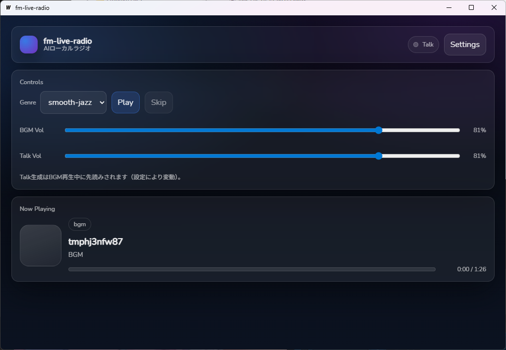

# fm-live-radio



AIローカルラジオ（Wails v2 + Go + React）。ローカルBGMをシャッフル再生しつつ、RSS記事を元にLLMで原稿を生成してGemini TTSでニューストークを挟みます。

AIコーディングサポートで作成しました。

## Features
- BGMジャンル（フォルダ）選択 + シャッフル再生（直前曲の連続回避）
- `BGM × N → Talk × 1` のサイクル再生（Nは設定可能）
- RSS複数登録 + ランダム選定 + 既出記事の重複排除（History）
- LLM（OpenAI互換）でトーク原稿生成
- Gemini TTS（REST）で音声生成（WAVにラップして保存）
- BGM / Talk で別ボリューム
- Talk生成のパイロットランプ（生成中/準備完了）

## Tech Stack
- Desktop: Wails v2 (Go)
- Frontend: React + Vite + TypeScript
- Backend: Go
- LLM: OpenAI互換API（例: Ollama/OpenRouter など）
- TTS: Gemini API（REST）

## 用意する物

- gemini API key (TTS生成のため)
- OpenAI 互換 API および利用キー (ニュース文章生成のため、ollama/LMstudio でも可)
- 再生する楽曲が入ったローカルファイルフォルダ
- ニュースのネタ元となる RSS url

## IMPORTANT: Tooling is managed by `mise`
このプロジェクトは **`mise` でツールチェーン（Go / Node / Wails）を管理**しています。

`go` / `npm` / `wails` は **直接実行しない**でください。必ず以下のいずれかで実行します。
- `mise x -- <command>`
- `mise run <task>`（`mise.toml` に定義されたタスク）

（開発者向けルールの詳細は `AGENTS.md` を参照）

まだ `mise` をインストールしていない場合は、以下の手順でインストールしてください。

**Windows (winget):**
```powershell
winget install jdx.mise
```

## Getting Started
### 1) Install tools
```pwsh
mise install
```

### 2) Install Wails CLI (once)
`mise.toml` の task を使います。
```pwsh
mise run setup
```

### 3) Generate Wails bindings
Go側のAPIを変更した場合は、フロントのバインディングを更新します。
```pwsh
mise x -- wails generate module
```

### 4) Run (dev)
```pwsh
mise run dev
```

### 5) Build
```pwsh
mise run build
```

## Configuration
初回起動後、Settings から以下を設定してください。
- BGM Root Path（BGMフォルダ）
- RSS URLs（1行1URL）
- LLM Base URL / Model（OpenAI互換, ollama や LMstudio も想定）
- Gemini API Key
- TTS Model / Voice
- Talk cycle（BGM→Talkの曲数）
- BGM / Talk volume

### Config/History location
設定と履歴、生成音声の一時ファイルは **OSのユーザー設定ディレクトリ**配下に保存されます（Goの `os.UserConfigDir()`）。

- `fm-live-radio/config.json` … 設定
- `fm-live-radio/history.json` … 既出記事URL履歴（上限500）
- `fm-live-radio/temp_audio/` … 生成Talk音声

`temp_audio/` は **起動時に全削除**されます。

## Development notes
- 依存更新やビルド確認も `mise` 経由で実行してください。
- Go側のAPI追加/変更後は `mise x -- wails generate module` が必要です。

## Contributing
Issue / PR welcome.
- バグ報告: 再現手順、ログ（APIキーなど秘匿情報は除く）、OS/バージョン情報を添えてください。
- PR: 可能なら `mise run dev` が通る状態でお願いします。

## Security
- APIキー（Gemini/LLM）は `config.json` に保存されます。
- ログにAPIキーが出ないようにしていますが、Issue貼り付け時は念のため秘匿情報をマスクしてください。

## 更新内容

- Dec.13.2025
  - first release


## License
MIT

## 作者

- **rerofumi** - [GitHub](https://github.com/rerofumi) - rero2@yuumu.org


