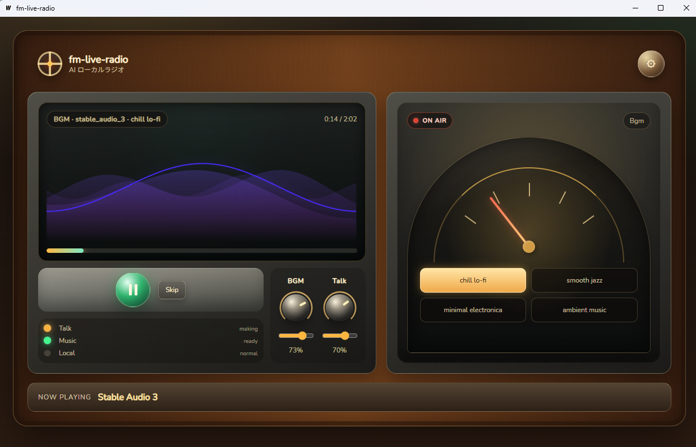

# fm-live-radio



Wails + Go + React で作った AI ローカルラジオです。  
BGM を流しながら RSS から記事を選び、LLM で原稿を作り、TTS でニューストークを差し込みます。

現在は以下の構成で動きます。

- **BGM**: Stable Audio 3 によるローカル生成
- **Talk**: IrodoriTTS v3 によるローカル生成
- **Local inference**: ONNX Runtime CPU / CUDA (`auto` / `cuda` / `cpu`)

---

## 🚀 手順 1: コードリポジトリからビルドして動かす

ソースコードからアプリケーションをビルド、または開発モードで動作させる手順です。

### 1. 前提条件と必要なツール
* **OS**: Windows x64
* **必須ツール**:
  * [mise](https://mise.jdx.co/) (バージョン・ツールチェーン管理ツール)
  * [uv](https://github.com/astral-sh/uv) (Python 依存解決・実行環境管理ツール)
* **外部サービス/API**:
  * OpenAI 互換の LLM API (例: Ollama, LM Studio, OpenRouter)
  * 任意の RSS フィードの URL

### 2. ツールチェーンと CLI のインストール
リポジトリのルートディレクトリで以下を実行し、ツールチェーンと Wails CLI をインストールします。

```powershell
# 1. ツールチェーン（Node.js, Go など）のインストール
mise install

# 2. Wails CLI のインストール
mise run setup
```

### 3. アセットとモデルの準備

#### ① ONNX Runtime GPU と依存 DLL の導入
GPU (CUDA) を利用した高速推論を行うための ONNX Runtime 1.26.0 と、対応する cuDNN/cuBLAS などの依存 DLL 群をスクリプトで一括導入します。
```powershell
powershell -ExecutionPolicy Bypass -File scripts\download_gpu_ort.ps1
```

#### ② Stable Audio 3 の重みファイル (ONNX) のダウンロード
Stable Audio 3 の最適化 ONNX モデル（モデル配布元: [stabilityai/stable-audio-3-optimized](https://huggingface.co/stabilityai/stable-audio-3-optimized)）をダウンロードします。
※ダウンロードには Stability AI のコミュニティライセンスへの同意が必要です。あらかじめ上記URLにて同意の上、必要に応じて Hugging Face のアクセストークン（Read）を環境変数 `HF_TOKEN` に設定してスクリプトを実行してください。
```powershell
# 必要に応じてトークンを設定（403等でダウンロードできない場合のみ）
$env:HF_TOKEN = "your_huggingface_token"

# ダウンロードスクリプトの実行
powershell -ExecutionPolicy Bypass -File scripts\download_sa3_models.ps1
```

#### ③ IrodoriTTS v3 の重みファイル (ONNX) の生成
IrodoriTTS v3 モデルは HuggingFace からダウンロードした上で、ONNX 形式への変換が必要です。変換には [mtsmfm/Irodori-TTS-ONNX](https://github.com/mtsmfm/Irodori-TTS-ONNX) の exporter を使用します。

1. 適当な作業用ディレクトリで `Irodori-TTS-ONNX` をクローンします。
   ```bash
   git clone https://github.com/mtsmfm/Irodori-TTS-ONNX.git
   cd Irodori-TTS-ONNX/onnx_exporter
   ```
2. `uv` を使用して依存関係をセットアップします。
   ```bash
   uv sync
   ```
3. 以下のエクスポートコマンドを実行し、モデルを `fm-live-radio` のモデルディレクトリに出力します。
   ```bash
   # output-dir のパスは fm-live-radio のルート配下にある `model/irodori-v3` を指定してください
   uv run irodori-tts-onnx-export \
       --hf-checkpoint Aratako/Irodori-TTS-500M-v3 \
       --output-dir /path/to/fm-live-radio/model/irodori-v3
   ```

#### ④ 話者参照 WAV ファイルの配置
* `narrator/narrator_01.wav` は最初からリポジトリに同梱されています。
* 声を変更したい場合は、このフォルダにお好みの声（wav形式）を追加・差し替えてください。

### 4. 動作テスト
GPU が正しく認識され、推論ができるかスモークテストで確認します。
```powershell
# 通常テスト (auto)
mise x -- go run ./cmd/local_smoketest

# GPU (CUDA) を強制してテスト
$env:FM_RADIO_ORT_EP='cuda'
mise x -- go run ./cmd/local_smoketest
Remove-Item Env:FM_RADIO_ORT_EP
```

### 5. アプリケーションの起動とビルド
```powershell
# 開発モードで起動
mise run dev

# 本番用 exe のビルド
# 実行ファイルは build/bin/fm-live-radio.exe に出力されます
mise run build
```

---

## 📦 手順 2: ビルド済みの exe を入手して動かす

すでにビルドされた `fm-live-radio.exe` のみを入手し、一般ユーザーとして動作させる手順です。

### 1. 動作に必要なファイルの配置
実行ファイル `fm-live-radio.exe` を任意のフォルダに配置し、そのフォルダをカレントディレクトリとして、以下のファイル・フォルダ構造を作成してください。

```text
任意のインストールフォルダ/
├── fm-live-radio.exe
│
├── model/
│   ├── sa3-sm-music/                 # 手順1の 3.② で入手した Stable Audio 3 モデル
│   └── irodori-v3/                   # 手順1の 3.③ で生成した IrodoriTTS v3 モデル
│
├── narrator/
│   └── narrator_01.wav               # 同梱の話者参照 WAV ファイル (任意)
│
└── third_party/
    └── onnxruntime-gpu/
        └── onnxruntime-win-x64-gpu-1.26.0/
            └── lib/
                ├── onnxruntime.dll   # 手順1の 3.① でダウンロードした DLL 群
                ├── cudnn64_9.dll
                ├── cublas64_13.dll
                └── ...
```
> [!NOTE]
> CPU のみで動作させる場合は、`third_party/onnxruntime-gpu/...` の代わりに CPU 版の `onnxruntime.dll` を `fm-live-radio.exe` と同じフォルダに直接配置するだけでも動作します。

### 2. アプリの起動と初回設定
1. `fm-live-radio.exe` を実行します。
2. 起動後、画面左下の `Settings` (歯車アイコン) を開き、以下の項目を設定します。
   * **RSS URLs**: 取得したい RSS フィードの URL（例: Impress Watch 等）
   * **LLM Base URL**: ローカル LLM 等の API エンドポイント (例: Ollama の場合は `http://localhost:11434/v1`)
   * **LLM Model**: 使用するモデル名 (例: `gpt-4o-mini` またはローカルモデル名)
   * **Local Inference Provider**: `auto` (GPUが使えれば自動使用) または GPU 強制時は `cuda`、CPUのみ時は `cpu` を選択します。
3. `Save Config` をクリックして設定を保存します。

---

## ⚙️ 詳細仕様・その他の情報

### 設定とデータの保存先
設定ファイルおよび生成履歴は、Windows の標準的なユーザー設定ディレクトリに保存されます。
- **設定ファイル**: `%APPDATA%\fm-live-radio\config.json`
- **履歴ファイル**: `%APPDATA%\fm-live-radio\history.json`
- **一時音声キャッシュ**: `%APPDATA%\fm-live-radio\temp_audio\` (起動時に自動クリーンアップされます)

### 開発時の注意事項
* `go`, `npm`, `wails` コマンドを直接実行しないでください。必ず `mise x -- <command>` または `mise run <command>` を経由させてください。
* Go の API 定義（構造体やバインド）を変更した場合は、以下を実行してフロントエンド用のコードを再生成してください。
  ```powershell
  mise x -- wails generate module
  ```

---

## 📄 ライセンス
[MIT License](LICENSE)
